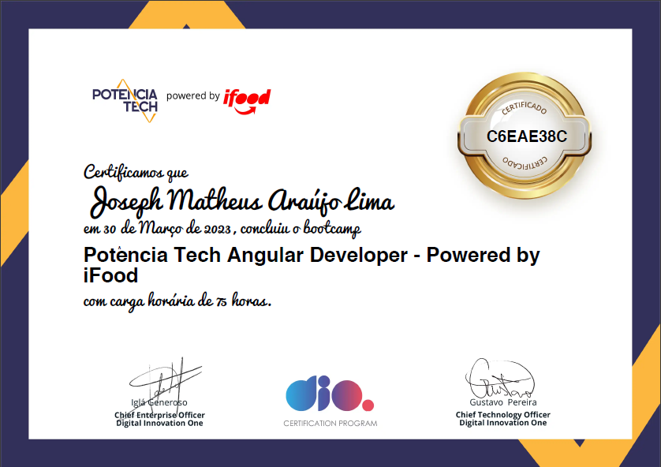

# **Potência Tech Angular Developer Powered by iFood**

Repositório para guardar os arquivos das aulas do bootcamp, que podem ser acessados explorando as pastas deste repositório

---

## Projetos Desenvolvidos no Bootcamp

- **[Angular Blog](https://github.com/josephmatheus/desafio-dio-angular-blog)**
- **[Clone BuzzFeed](https://github.com/josephmatheus/desafio-dio-clone-buzzfeed-angular)**

## Certificado

